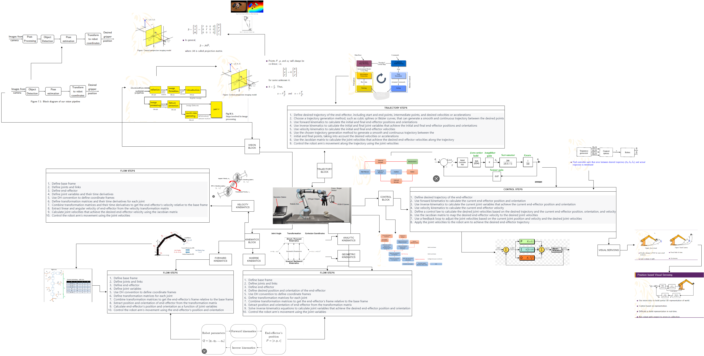

# EE-CE-CS-366-366-380-Introduction-to-Robotics
This GitHub repository contains the homework assignments completed as part of the course EE-CE-CS-366-366-380: Introduction to Robotics. The assignments include four different blocks: Vision Block, Forward Kinematics Block, Inverse Kinematics Block, Control Block, and Trajectory Block. Each block is a crucial aspect of robotics, and the assignments aim to help students understand and implement them in practical scenarios.

The Vision Block assignment focuses on understanding computer vision techniques and how they can be applied to robotics. Students will learn about camera calibration, image processing, and object recognition techniques.

The Forward Kinematics Block assignment focuses on understanding the relationship between joint angles and end-effector position and orientation. Students will implement forward kinematics equations to compute the end-effector position and orientation of a robotic arm.

The Inverse Kinematics Block assignment focuses on understanding how to determine the joint angles required to achieve a specific end-effector position and orientation. Students will implement inverse kinematics equations to compute the joint angles required for the robot to reach a specific location and orientation.

The Control Block assignment focuses on understanding how to control the motion of a robotic arm. Students will implement control algorithms to control the position, velocity, and acceleration of the robot's end-effector.

The Trajectory Block assignment focuses on understanding how to plan and execute a trajectory for a robotic arm. Students will implement trajectory planning algorithms to generate smooth and efficient paths for the robot to follow.
